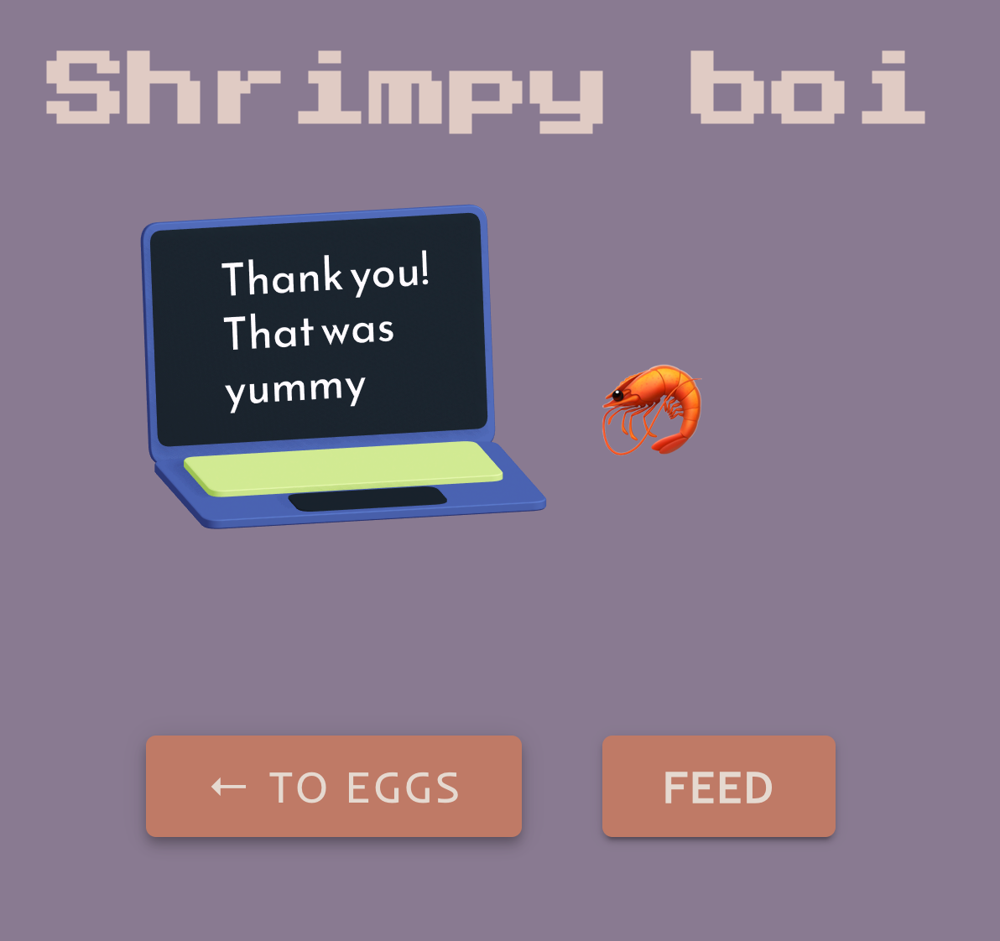
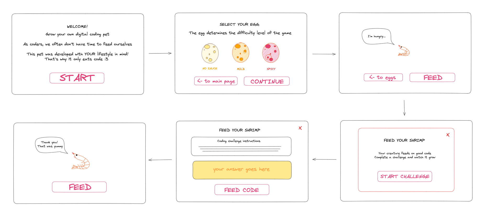
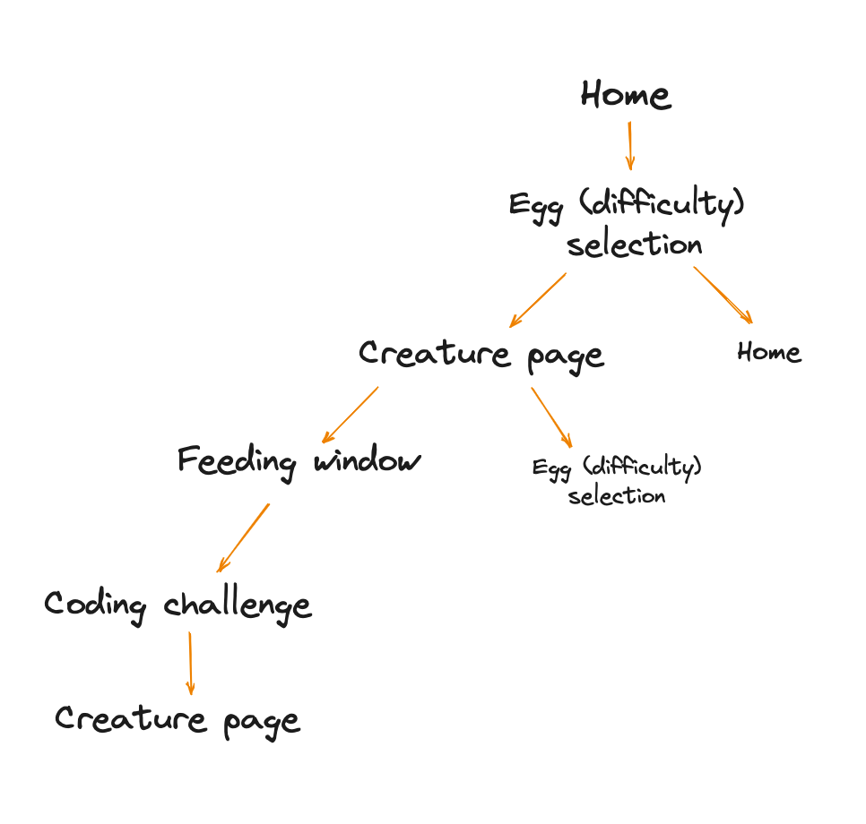
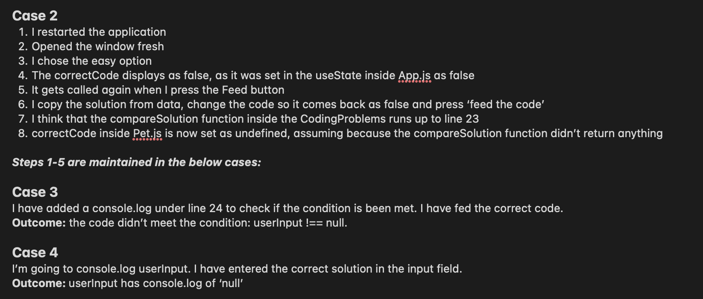

# TAMAGOTCHI APP :space_invader:
A digital pet made specifically for programmers because the only thing this pet eats is good JavaScript code! The pet's character was inspired by the posture of a shrimp that may result due to prolonged hours spent coding in front of the computer 🦐

## :computer: [Click here](https://react-tamagotchi.surge.sh/) to feed your pet

## :page_facing_up: About
This project was unique from my previous experiences as I had a client who provided me with specific requirements for the Tamagotchi app. The client's requirements included:
- Create a selection of coding challenges (or use an API)
- User should be able to choose a difficulty setting
- Display a visually appealing creature
- Code challenge to be displayed to the user, with instructions
- User should have an input for code to be submitted
- Correct code causes the creature to grow and say a positive comment
- Bad code causing the creature to shrink and verbalize its disgust

Throughout the development process, I followed an iterative approach to meet the Minimum Viable Product (MVP) first and then worked on implementing additional features. I regularly communicated with my client and provided daily progress updates to ensure their requirements were met.

In addition to meeting the client's requirements, I set a personal goal to focus on creating a pleasant design for the app. This allowed me to go beyond the content covered in the course and further develop my skills in reading documentation and implementing visually appealing interfaces.

**How to use the app:**
1. Press 'Start' on the landing page to start the game.
2. Next select the difficulty of the game, which in turn determines the difficulty of the coding problems you'll be asked to solve. Please note that you won't be able to proceed unles the difficulty is selected.
3. Press the 'Continue' button and now you can your pet, who's very hungry for code!
4. Press the 'Feed' button and then 'Start Challenge' to get your first coding problem.
5. The problem will be displayed at the top of the screen and your answer will need to go into the input box under it.
6. You can test your code by pressing the 'Test' button and once you are satisfied click 'Feed the code' to feed it to your pet.
7. Your pet will grow (or not) and let you know if it's happy with its meal. Remember, it only eats good code!

## :pencil2: Planning & Problem Solving
**Wireframes:**
Before beginning the development process, I started by creating wireframes to visualize the layout and structure of the Tamagotchi app. The wireframes helped me plan the placement of different components and ensure a user-friendly interface. 

**App Architecture:**
To ensure a well-structured and maintainable codebase, I designed the architecture of the Tamagotchi app. I followed a modular approach, separating different functionalities into components as you will not in my codebase. This allowed for easier development, debugging, and future enhancements. 
{width="200" height="auto"}

**User Stories:**
To ensure a user-friendly and intuitive user experience, I created user stories based on the client's requirements. User stories helped me define the features and interactions necessary to meet the client's expectations. Here are some example user stories:
- As a user, I want to be greeted by the game when I open the app.
- As a user, I want to see a visually appealing shrimp-like creature and a button indicating food on the screen after selecting an egg.
- As a user, I want to click the "start challenge" button to display a JavaScript coding challenge with instructions.
- As a user, I want to have an input field where I can enter my solution under the challenge instructions.
- As a user, I want to click the "feed code" button next to the input to check my solution and see the creature's reaction.

**Problem Solving Approach:**
During the development process, I adopted a systematic approach to problem-solving. For more complex problems or issues, I followed these steps:

1. *Identifying the Problem:* I first identified the specific problem or issue I encountered. This involved thoroughly understanding the desired behavior and comparing it to the actual behavior of the app.
2. *Hypothesis:* After identifying the problem, I formulated a hypothesis about the possible cause or solution. This helped me have a clear direction in addressing the issue.
3. *Testing:* I tested my hypothesis by making small changes to the code, implementing potential solutions, or debugging specific parts of the app. I documented the changes I made and carefully observed the outcomes.
4. *Outcome:* I recorded the outcomes of each test or change made. This included whether the issue was resolved, the impact on other functionalities, or any new issues that arose. This documentation helped me track the progress and maintain an organized troubleshooting process.

By following this problem-solving approach, I aimed to ensure the stability and functionality of the Tamagotchi app throughout its development lifecycle.

## :rocket: Cool tech
- Coding languages: JSX, CSS, JavaScript.
- Web framework: React.
- Deployment: Surge.
- Libraries: [MUI](https://mui.com/).
- Design related: [Spline](https://app.spline.design/home), [Fontjoy](https://fontjoy.com/), [Khroma](https://www.khroma.co/generator).
- Code editor: Visual Studio Code.

## :scream: Bugs to fix :poop:
- Not enough coding problems, which results in the same problem coming up multiple times in a row sometimes.
- If random letters/text is written in the input field without quatations the code won't be evaluated and the 'Feed code' button doesn't redirect the user to the next page. From the UX point of view there's no warning to tell the user why this is happening and the code base doesn't take this case into account.
- Certain coding problems don't work with the eval() function, produces errors and results in the above described UX. Ended up removing some problems. 

## :sob: Lessons learnt
- It's important to take breaks. Problem solving is faster with a fresh brain.
- Documenting the process of problem solving can help solve the problem faster and cause less frustration. Especially with larger blocks of code and when it's unclear where a bug has occured.
- Providing regular reports to the client about the progress of the work makes them feel safe, helps to build trust, and assists in eliminating any potential misunderstandings in the future.

## :white_check_mark: Future features
- Users can sign up in order to save their progress in the game.
- Users can select a pet and a enter name for it.
- Users will only get the same problems after they have successfully completed all of the exisiting problems.
- A user can press 'Restart button' to start the game from the beginning.
- Different coding languages can be selected instead of only JavaScript.
- The creature doesn't only grow, but also changes in its appearance.
- The pet can be interacted with in different ways, such as playing, training and cleaning after the pet, other than only feeding.