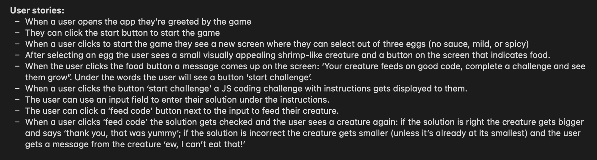

# TAMAGOTCHI APP :space_invader:
A digital pet made specifically for programmers because the only thing this pet eats is good JavaScript code! The pet's character was inspired by the posture of a shrimp that may result due to prolonged hours spent coding in front of the computer 🦐

## :computer: [Click here](https://react-tamagotchi.surge.sh/) to feed your pet

## :page_facing_up: About
**How to use the app:**
1. Press 'Start' on the landing page to start the game.
2. Next select the difficulty of the game, which in turn determines the difficulty of the coding problems you'll be asked to solve. Please note that you won't be able to proceed unles the difficulty is selected.
3. Press the 'Continue' button and now you can your pet, who's very hungry for code!
4. Press the 'Feed' button and then 'Start Challenge' to get your first coding problem.
5. The problem will be displayed at the top of the screen and your answer will need to go into the input box under it.
6. You can test your code by pressing the 'Test' button and once you are satisfied click 'Feed the code' to feed it to your pet.
7. Your pet will grow (or not) and let you know if it's happy with its meal. Remember, it only eats good code!

## :pencil2: Planning & Problem Solving
The work on this project commenced with a detailed plan on how we want our app to look, what functionality it will have and what tools we need to set up to get started with it.

First, the functionality of the app was written in the form of user stories that were later used in the Trello app to assign responsibilites and tasks amongs the members of the group. 

Then the wireframes for the app were put together:

The app needed to have a database set up that consists of two tables of user and quote data with an extra table for the favourite quotes as a future feature:

The GitHub repositary was set up to allow us to code and work as a group on the app. Version control and repo branches became our best friends in this journey. One member was nominated as a Git Leader who managed the merging of work on Git and everyone else was collaborating by using pull requests. We learnt how to work together efficiently and not overlap our code.

Finally, the app was deployed on Render and any deployment related errors were fixed. 

## :rocket: Cool tech
- Coding languages: JSX, CSS, JavaScript.
- Web framework: React.
- Deployment: Surge.
- Libraries: [MUI](https://mui.com/).
- Design related: [Spline](https://app.spline.design/home), [Fontjoy](https://fontjoy.com/), [Khroma](https://www.khroma.co/generator).
- Code editor: Visual Studio Code.

## :scream: Bugs to fix :poop:
- Not enough coding problems, which results in the same problem coming up multiple times in a row sometimes.
- If random letters/text is written in the input field without quatations the code won't be evaluated and the 'Feed code' button doesn't redirect the user to the next page. From the UX point of view there's no warning to tell the user why this is happening and the code base doesn't take this case into account.
- Certain coding problems don't work with the eval() function, produces errors and results in the above described UX. Ended up removing some problems. 

## :sob: Lessons learnt
- It's important to take breaks. Problem solving is faster with a fresh brain.
- Documenting the process of problem solving can help solve the problem faster and cause less frustration. Especially with larger blocks of code and when it's unclear where a bug has occured.
- Providing regular reports to the client about the progress of the work makes them feel safe, helps to build trust, and assists in eliminating any potential misunderstandings in the future.

## :white_check_mark: Future features
- Users can sign up in order to save their progress in the game.
- Users can select a pet and a enter name for it.
- Users will only get the same problems after they have successfully completed all of the exisiting problems.
- A user can press 'Restart button' to start the game from the beginning.
- Different coding languages can be selected instead of only JavaScript.
- The creature doesn't only grow, but also changes in its appearance.
- The pet can be interacted with in different ways, such as playing, training and cleaning after the pet, other than only feeding.